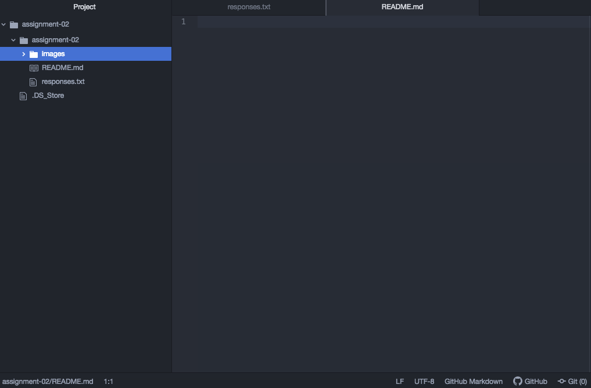

# Assignment-02
## Dylan Smith

I enrolled in this course because it is an elective that allows me the ability to potentially pursue a Digital Marketing certificate while also satisfying my elective requirements to achieve getting my Marketing degree. After reading the course description, I was convinced that learning the concepts in this course would make me an asset to an organization. I realized what I would learn in this course would pair well with what I had learned in BMIS 478 E-Commerce. I also was interested in taking this course because it is online and it allows me the freedom to set my own hours so that I can work 60 hours a week.

A list of things I have learned:

- The logistics of the internet
- The internet is a design philosophy that has adapted
- IPv6 will allow 340 undecillion unique addresses for devices

[ESPN](https://www.espn.com/)

[My Responses File](./responses.txt)

