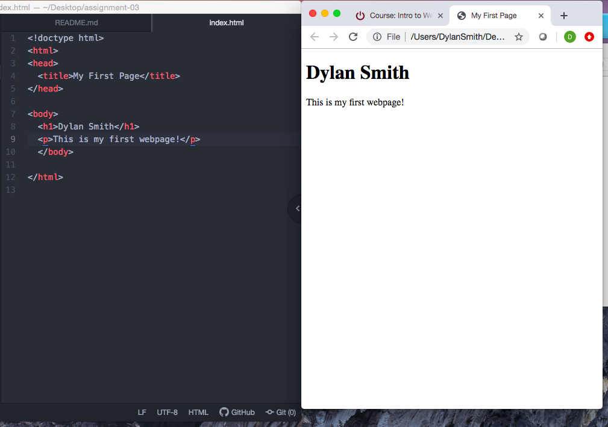

# Assignment-03
## Dylan Smith

First, a request is sent to the server. The server responds with a collection of web content. The browser then interprets the content returned and displays the webpage; I currently use the web browsers Google Chrome which is supported by javascript interpreter V8 and I also use Firefox which is supported by javascript interpreter Spider Monkey.

Markup languages are computer languages designed to process, define and present elements within a document. A markup language that is commonly used in development is HTML which acts as a foundation and structure of a page’s content.

