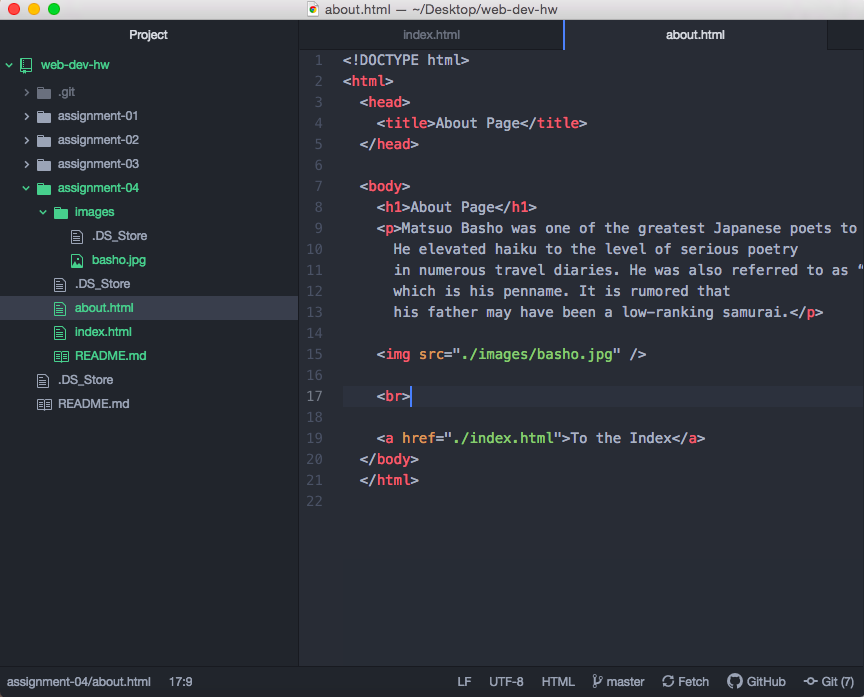

# Assignment 04
## Dylan Smith

I visited Ebay because of the many times I have used this site to purchase limited sneakers. Back in 1999, It appeared to look like a website living in squalor and asking for spare change. There was a lot of links and not many pictures.  The design looked like it was made during a beginners class. Now the website for Ebay looks pristine and full of life with bright vivid pictures and graphics that mean business.

My experience with the GIT module was a pleasant one. I learned a lot about how the internet works and the logistics of the internet and how we are able to use it. I also learned that the internet was designed to be a means of communication if our nation was hit by a nuclear bomb. I would actually say understanding how the internet works was the most difficult to comprehend just because of how technical it is. I may get confused about the differences between writing in html and writing in markdown.

