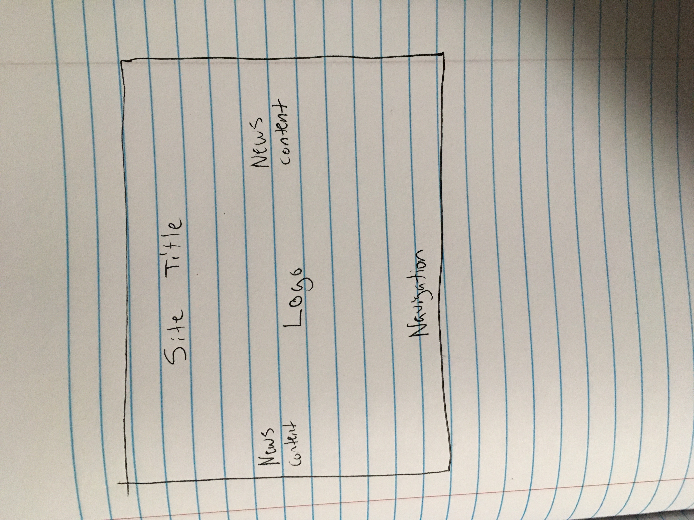

Borders are a visual styling tool that can be seperately colored and has multiple style options. Padding is the amount of space between the inner content of an element and the element itself. Margins are the space between the box/element and other elements, or the edge of the parent element.

I started reading the materials on Friday November 15 and tried my best to digest it and do the best I could without the benefit of having as many resources as I had in weeks prior. This was the most miserable experience that I have had the entire semester out of all the classes I currently have. I am dreading the rest of the semester, this assignment sucked out all the desire and passion I had to do want to do well in this class. I have no idea if I am doing a good job in this class or not because assignments don't get graded and at this point I am just crossing my fingers and hoping for the best. 
